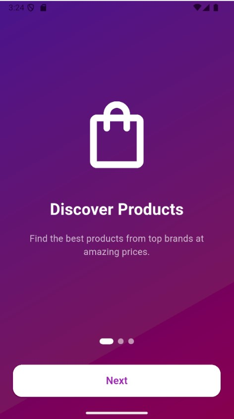
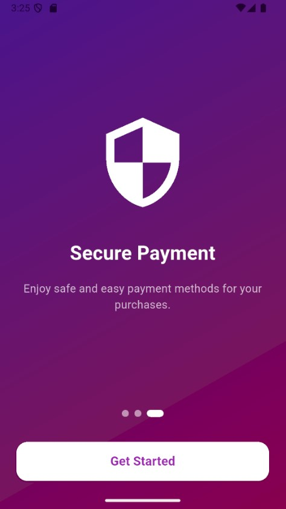
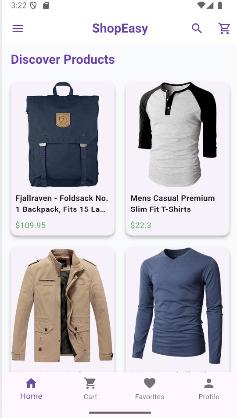
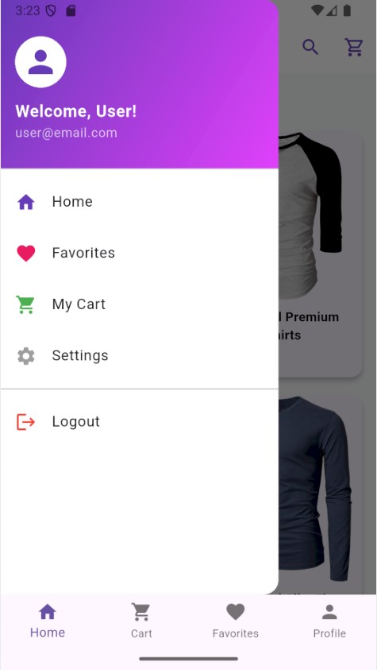

# ShopEasy - Flutter E-Commerce App

**ShopEasy** is a full-featured e-commerce mobile application built with **Flutter** and **Dart**, following **Clean Architecture** principles.  
This project showcases advanced Flutter skills through attractive UI, smooth animations, and robust state management using **Riverpod**.

---

## 📌 Key Features

- **Splash Screen**: Stylish and animated logo with a loader.  
- **Onboarding Screen**: Creative design with a “Get Started” button leading to the main app.  
- **Home Screen**:  
  - Grid view of products with smooth **FadeInUp** animations.  
  - AppBar with search icon, cart icon, and gradient menu.  
- **Product Details Screen**:  
  - Displays product image, title, price, and description.  
  - **Add to Cart** button with Snackbar confirmation.  
  - Favorite management (add/remove from favorites).  
- **Cart Screen**: Manage added products (expandable later for quantity & total price).  
- **Favorites Screen**: Stores favorite products and displays them via Bottom Navigation.  
- **Bottom Navigation Bar** for easy navigation: Home, Cart, Favorites, Profile.    
- State management with **Riverpod**.  
- Networking via **Dio** to fetch products from API.  
- Local storage with **Hive** for cart and favorites.  
- **Clean Architecture** separating Presentation, Domain, and Data layers.  
- Smooth animations using **animate_do** library.

---

## 🖼️ Screenshots

| intro screen | start Screen |
|---------------|-----------------|
|  |  |

| Home Screen | Home Menu |
|------------|----------------------|
|  |  |
